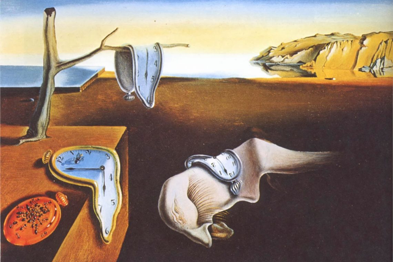

> 「耿耿星河梦日来」 

 ``--`` by [Salvador Dali](https://www.moma.org/collection/works/79018) 1931.

## Bio

I got my Ph.D. from the [National University of Singapore](https://nus.edu.sg/) in May 2024, and my B.S. degree from the [Southern University of Science and Technology](https://www.sustech.edu.cn/) in July 2018.

For more details, please visit my [personal website](https://gengxingri.github.io).

---

##  Interests

I have lots of interests in sports:

 * **Running**

 * **Swimming**

 * **Tennis**

 * **Boxing**

Beyond athletics, I am also an enthusiastic admirer of [Glove Puppetry](https://en.wikipedia.org/wiki/Glove_puppetry)—a traditional form of Chinese opera that uses cloth puppets. Originating in the 17th century in Quanzhou or Zhangzhou, Fujian Province, glove puppetry (known as *pò͘-tē-hì* in Min Nan) blends intricate craftsmanship, expressive performance, and rich cultural storytelling.

---

## Contact

* **Email:** gengxingri@gmail.com
